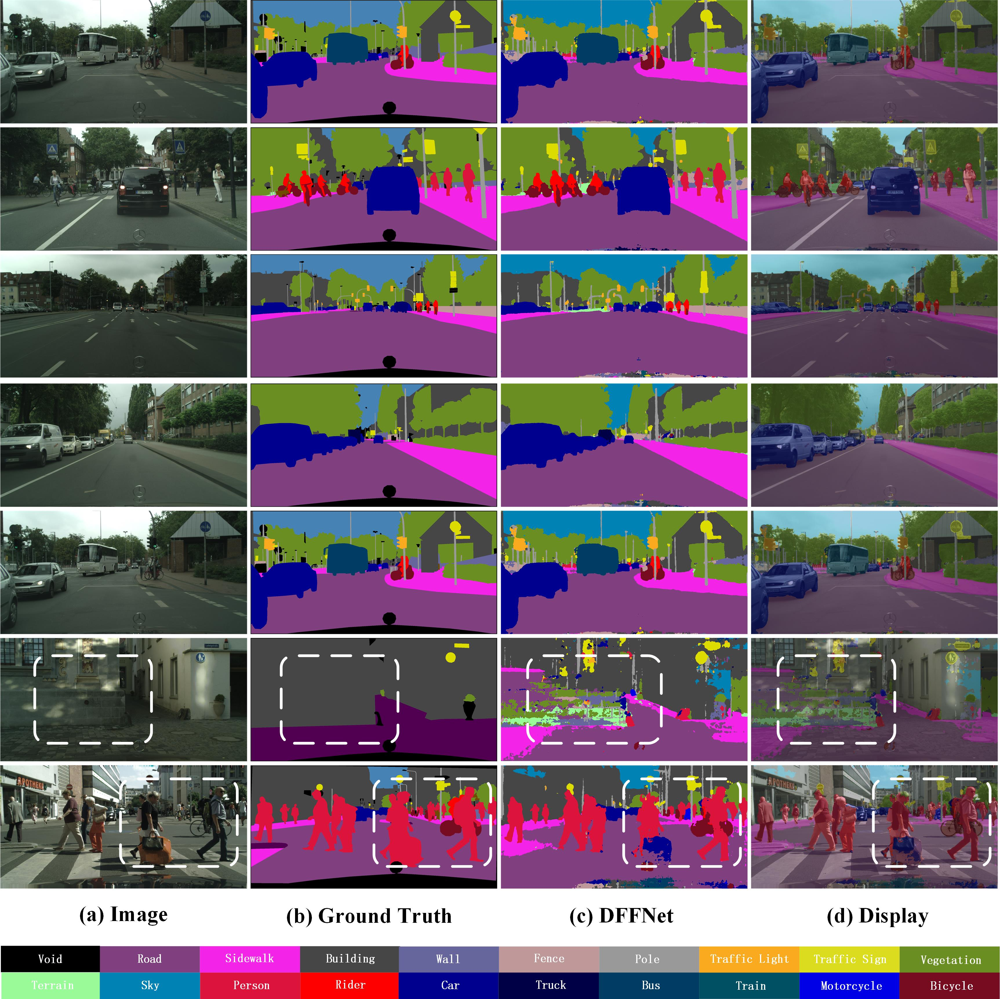

## DFFNet
<span id="jump1"></span>


###  [Paper](https://ieeexplore.ieee.org/stamp/stamp.jsp?tp=&arnumber=9032321)

Context-Integrated and Feature-Refined Network for Lightweight Object Parsing.<br>

Bin Jiang, [Wenxuan Tu](https://github.com/WxTu/CIFReNet/), Chao Yang, Junsong Yuan.<br>

IEEE Transactions on Image Processing, 29: 5079-5093, 2020.<br>

DOI: 10.1109/TIP.2020.2978583.<br>

### [License](https://raw.githubusercontent.com/nvlabs/SPADE/master/LICENSE.md)


All rights reserved.
Licensed under the [Apache License 2.0](http://www.apache.org/licenses/LICENSE-2.0) 

The code is released for academic research use only. For commercial use, please contact [twx@hnu.edu.cn].


## Installation

Clone this repo.
```bash
git clone https://github.com/WxTu/CIFReNet.git
```

* Windows or Linux
* Python3
* [Pytorch(0.3+)](https://pytorch.org/)
* Numpy
* Torchvision
* Matplotlib


## Preparation

We use [Cityscapes](https://www.cityscapes-dataset.com/), [Camvid](http://mi.eng.cam.ac.uk/research/projects/VideoRec/CamVid/) and [Helen](http://www.f-zhou.com/fa_code.html) datasets. To train a model on these datasets, download datasets from official websites.

Our backbone network is pre-trained on the ImageNet dataset provided by [F. Li et al](http://www.image-net.org/). You can download publically available pre-trained MobileNet v2 from this [website](https://github.com/ansleliu/LightNet).

## Code Structure
- `data/Dataset.py`: processes the dataset before passing to the network.
- `model/CIFReNet.py`: defines the architecture of the whole model.
- `model/Backbone.py`: defines the encoder.
- `model/Layers.py`: defines the DSP, MCIM, and others.
- `utils/Config.py`: defines some hyper-parameters.
- `utils/Process.py`: defines the process of data pretreatment.
- `utils/Utils.py`: defines the loss, optimization, metrics, and others.
- `utils/Visualization.py`: defines the data visualization.
- `Train.py`: the entry point for training and validation.
- `Test.py`: the entry point for testing.

<span id="jump2"></span>

## Visualization


## Contact
[twx@hnu.edu.cn](twx@hnu.edu.cn)

[wenxuantu@163.com](wenxuantu@163.com)

Any discussions or concerns are welcomed!

## Citation
If you use this code for your research, please cite our papers.
```
@article{Jiang2020Context,
  title={Context-Integrated and Feature-Refined Network for Lightweight Object Parsing},
  author={Bin Jiang, Wenxuan Tu, Chao Yang, Junsong Yuan},
  journal={IEEE Transactions on Image Processing},
  volume={29},
  pages={5079-5093},
  year={2020},
}
```
## Acknowledgement

[https://github.com/ansleliu/LightNet](https://github.com/ansleliu/LightNet)

[https://github.com/meetshah1995/pytorch-semseg](https://github.com/meetshah1995/pytorch-semseg)

[https://github.com/zijundeng/pytorch-semantic-segmentation](https://github.com/zijundeng/pytorch-semantic-segmentation)

[https://github.com/Tramac/awesome-semantic-segmentation-pytorch](https://github.com/Tramac/awesome-semantic-segmentation-pytorch)


